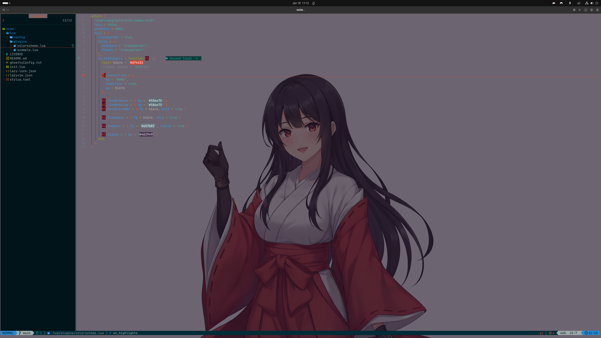

# 💤 My LazyVim Config

## About

### **Terminal:** [Ghostty](https://ghostty.org/docs)
### **Distribution:** [LazyVim](https://github.com/LazyVim/LazyVim)
### **Base Theme:** [Solarized Osaka Theme](https://github.com/craftzdog/solarized-osaka.nvim).
### **Font:** [AskaydiaCove Nerd Font](https://www.nerdfonts.com/font-downloads)



## Installation
### Clearing Neovim data
Remove conflicting data from previous installations:
```
bash
rm -rf ~/.local/share/nvim
rm -rf ~/.local/state/nvim
rm -rf ~/.cache/nvim
```

### Installing Neovim from PPA
Installing from the PPA to get a stable version that is advanced enough in versions for lazyvim (snap is messy and apt repo is outdated).
```
bash
sudo add-apt-repository ppa:neovim-ppa/unstable -y
sudo apt update
sudo apt install neovim -y
```

### Getting the LazyVim configuration
For a fresh configuration, go to [LazyVim](https://github.com/LazyVim/LazyVim).
For this configuration, clone this repo.

### Installing Ghostty
Check [Ghostty](https://ghostty.org/docs).

### Configuring Ghostty
Copy the code at ghosttyConfig.txt and paste it at the end of `~/.config/ghostty/config`.

